# ioBroker.schedule-switcher

[Zurück zur README](/README.md)

# Einleitung

Dieser Adapter ermöglicht es dem Benutzer, Geräte mithilfe von Zeitplänen ein-/auszuschalten oder 100/0.
Die Zeitpläne können vollständig über ein Vis- oder Vis-2-Widget konfiguriert werden.
Ein Zeitplan wechselt einen oder mehrere ioBroker-Zustände und besteht aus einem oder mehreren Auslösern, die definieren, wann und wie der Zustand gewechselt werden soll.
Es kann konfiguriert werden, zu welcher Uhrzeit und an welchen Wochentagen der Trigger ausgelöst werden soll. Es können auch Astro-Trigger oder Countdowns erstellt werden.

# Zusammenfassung

-   [Instanz Einstellungen](#instanz-einstellung-schedule-switcher)
-   [Objekte](#states)
-   [Beispiel Trigger als JSON](#beispiel-auslöser-json)
-   [Beispiel sendTo Trigger nur Experten](#beispiel-auslöser-mit-sendto-anlegen-oder-editieren-experten)
-   [Beispiel Widget als JSON](#beispiel-widgets-json)
-   [Beispiel Historie als JSON](#beispiel-historie-json)
-   [Widget anlegen](#widget-anlegen)
-   [Namen ändern](#namen-ändern)
-   [Bedingungen hinzufügen](#bedingung-hinzufügen)
-   [Text ersetzen](#text-ersetzen)
-   [CSS Einstellungen](#css-anwenden)
-   [Trigger anlegen](#trigger)
-   [Astrotrigger anlegen](#astro-trigger)
-   [Einmaltrigger anlegen](#one-time-trigger)
-   [CSS](#css)

### Instanz Einstellung schedule-switcher

[Zusammenfassung](#zusammenfassung)

-   `+ Zeichen`: Neuen Zeitplan hinzufügen
-   `Schaltplandaten Id`: Erstellte Objekte
-   `Name`: Name vom Widget
-   `Anzahl Auslöser`: Anzahl der Auslöser
-   `Aktiv`: Aktiv
-   `Löschen`: Zeitplan löschen
-   `Verzögerung zwischen 2 Schaltvorgängen in ms`: Verhindert zeitgleiches setzen von States
-   `Historie Umschaltung als JSON (max. 100/0 für Aus)` Max. Speicherung der Historie

    

### States

[Zusammenfassung](#zusammenfassung)

-   onoff
-   `schedule-switcher.0.onoff.6.data` Alle Auslöser als JSON
-   `schedule-switcher.0.onoff.6.enabled` Aktiv oder Inaktiv
-   `schedule-switcher.0.onoff.6.views` Wo wurden Widgets für die Objekte angelegt
-   Historie
-   `schedule-switcher.0.sendto` Histerie der Schaltungen
-   sendTo
-   `schedule-switcher.0.sendto` Bei VIS-2 werden Änderungen über dieses Objekt an den Adapter übergeben


# Beispiel Auslöser JSON

[Zusammenfassung](#zusammenfassung)

```json
{
    "type": "OnOffSchedule",
    "name": "Rolllade Wohn", // Name vom letzten erstellte Widget
    "onAction": {
        // Action für On
        "type": "OnOffStateAction",
        "valueType": "number",
        "onValue": 0,
        "offValue": 100,
        "booleanValue": true,
        "idsOfStatesToSet": ["0_userdata.0.test4"] // States max. 10
    },
    "offAction": {
        // Action für Off
        "type": "OnOffStateAction",
        "valueType": "number",
        "onValue": 0,
        "offValue": 100,
        "booleanValue": false,
        "idsOfStatesToSet": ["0_userdata.0.test4"] // States max. 10
    },
    "triggers": [
        {
            "type": "AstroTrigger", // Trigger - AstroTrigger - OneTimeTrigger
            "astroTime": "sunrise",
            "shiftInMinutes": 0,
            "weekdays": [1, 2, 3, 4, 5, 6],
            "id": "0",
            "action": {
                "type": "ConditionAction",
                "condition": {
                    "type": "StringStateAndConstantCondition",
                    "constant": "true",
                    "stateId": "0_userdata.0.test",
                    "sign": "=="
                },
                "action": {
                    "type": "OnOffStateAction",
                    "name": "On"
                }
            }
        }
    ]
}
```

# Beispiel Widgets JSON

[Zusammenfassung](#zusammenfassung)

```json
{
    "vis-2.0": {
        // Welche VIS Version
        "Timer": {
            //Projekt
            "w000009": {
                // Widget ID
                "prefix": "Timer", //Projekt
                "namespace": "vis-2.0", // Welche VIS Version
                "view": "default", // Welche View
                "widgetId": "w000009", // Widget ID
                "newId": "timer-switch.0.onoff.0.data", // Neues Object
                "oldId": "timer-switch.0.onoff.1.data" // Altes Object
            }
        },
        "main": {
            "w00003": {
                "prefix": "main",
                "namespace": "vis-2.0",
                "view": "Rollladen",
                "widgetId": "w00003",
                "newId": "timer-switch.0.onoff.0.data"
            }
        }
    }
}
```

# Beispiel Auslöser mit sendTo anlegen oder editieren (Experten)

[Zusammenfassung](#zusammenfassung)

```JSON
sendTo("schedule-switcher.0", "add-trigger", { // Neuen Auslöser anlegen
    "dataId":"schedule-switcher.0.onoff.6.data",
    "triggerType":"TimeTrigger",
    "actionType":"OnOffStateAction"
});

sendTo("schedule-switcher.0", "update-trigger", { // Aktion für den neuen Auslöser festlegen
    "dataId":"schedule-switcher.0.onoff.6.data",
    "trigger":{
        "type":"TimeTrigger",
        "hour":12,
        "minute":32,
        "weekdays":[1,2,3,4,5],
        "id":"0", // ID abgleichen
        "action":{
            "type":"OnOffStateAction",
            "name":"On"
        }
    }
});

sendTo("schedule-switcher.0", "add-trigger", { // Neuen Astrotrigger anlegen
    "dataId":"schedule-switcher.0.onoff.6.data",
    "triggerType":"AstroTrigger",
    "actionType":"OnOffStateAction"
});

sendTo("schedule-switcher.0", "update-trigger", { // Aktion für den neuen Auslöser festlegen
    "dataId":"schedule-switcher.0.onoff.6.data",
    "trigger":{
        "type":"AstroTrigger",
        "astroTime":"sunrise", // sunrise, sunset or solarNoon
        "shiftInMinutes":0,
        "weekdays":[1,2,3,4,5],
        "id":"0", // ID abgleichen
        "action":{
            "type":"OnOffStateAction",
            "name":"On"
        }
    }
});

sendTo("schedule-switcher.0", "disable-schedule", { // Auslöser deaktivieren
    "dataId":"schedule-switcher.0.onoff.6.data"
});

sendTo("schedule-switcher.0", "enable-schedule", { // Auslöser aktivieren
    "dataId":"schedule-switcher.0.onoff.6.data"
});

sendTo("schedule-switcher.0", "add-one-time-trigger", { // Einmalauslöser anlegen
    "dataId":"schedule-switcher.0.onoff.6.data",
    "trigger":"{\"type\":\"OneTimeTrigger\",\"date\":\"2024-10-17T06:14:22.660Z\",\"timedate\":false,\"action\":{\"type\":\"OnOffStateAction\",\"name\":\"On\"}}"
});

sendTo("schedule-switcher.0", "delete-trigger", { // Auslöser mit bekannter ID löschen
    "dataId":"schedule-switcher.0.onoff.6.data",
    "triggerId":"0"
});
```

# Beispiel Historie JSON

[Zusammenfassung](#zusammenfassung)

```JSON
[
  {
    "setObjectId": "0_userdata.0.test4",
    "objectId": 0,
    "value": "true",
    "object": "0_userdata.0.test4",
    "trigger": "TimeTrigger",
    "astroTime": "unknown",
    "shift": 0,
    "date": 0,
    "hour": 20,
    "minute": 48,
    "weekdays": [
      [
        1,
        2,
        3,
        4,
        5,
        6,
        0
      ]
    ],
    "time": 1729622880040
  },
  {
    "setObjectId": "0_userdata.0.test4",
    "objectId": 0,
    "value": "true",
    "object": "0_userdata.0.test4",
    "astroTime": "unknown",
    "shift": 0,
    "date": 0,
    "hour": 20,
    "minute": 47,
    "weekdays": [
      [
        1,
        2,
        3,
        4,
        5,
        6,
        0
      ]
    ],
    "time": 1729622820071
  }
]
```

# Beispiel Widget View JSON

[Zusammenfassung](#zusammenfassung)

```json
{
    "vis-2.0": {
        "main": {
            "w000004": {
                "prefix": "main", // Projekt
                "namespace": "vis-2.0", // VIS
                "view": "default", // View
                "widgetId": "w000004", // Widget ID
                "newId": "schedule-switcher.0.onoff.3.data" // Objekt ID
            }
        }
    },
    "vis.0": {
        "main": {
            "w00001": {
                "prefix": "main",
                "namespace": "vis.0",
                "view": "Rollo",
                "widgetId": "w00001",
                "newId": "schedule-switcher.0.onoff.3.data"
            }
        }
    }
}
```

### Widget anlegen

[Zusammenfassung](#zusammenfassung)

-   Widget in einer View einfügen

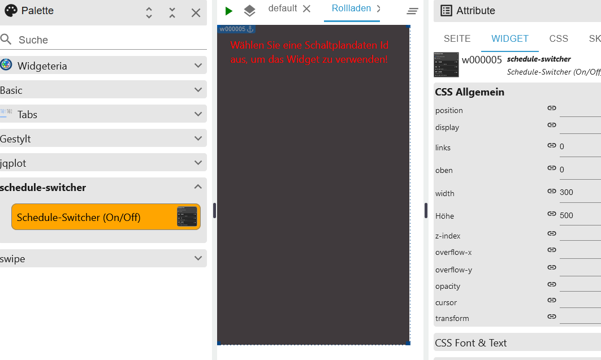

-   ID für Schaltplandaten auswählen
-   Zeitplan Aktivierungs ID auswählen
-   ID vom geschaltenen State auswählen (max. 10 möglich)


-   Wertetype festlegen und die Werte die gesetzt werden sollen


-   Nun einen Schaltplan erstellen


### Namen ändern

[Zusammenfassung](#zusammenfassung)

-   Namen ändern - Wird in den Objekten auch übernommen

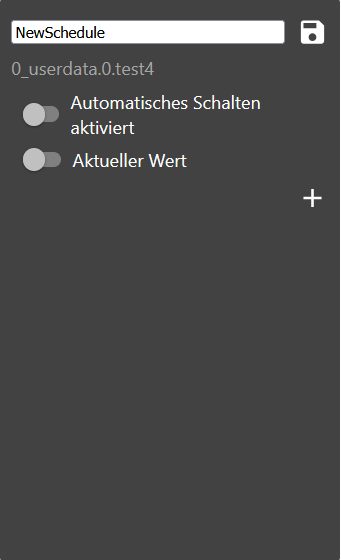

### Bedingung hinzufügen

[Zusammenfassung](#zusammenfassung)

-   Eine Bedingung festellen.


### Text ersetzen

[Zusammenfassung](#zusammenfassung)

-   Text an/aus und alles an/alles aus ändern


### CSS anwenden [Beschreibung siehe css](#css)

[Zusammenfassung](#zusammenfassung)

-   Verwende CSS aktivieren um den Style anzupassen</br>
    </br>
    </br>
    </br>
    </br>
    </br>
    </br>
    </br>
    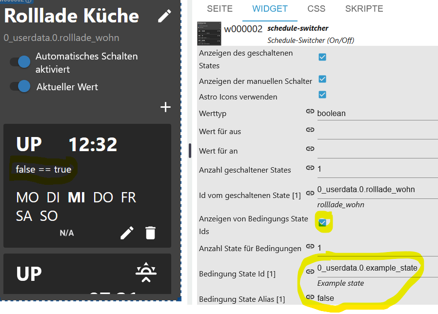</br>
    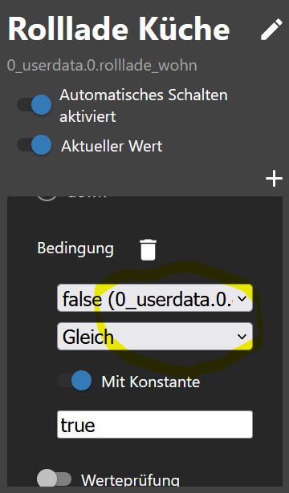

### Trigger

[Zusammenfassung](#zusammenfassung)

-   Den Stift anklicken um die Zeit einzutragen oder die Mülltonne um den Trigger zu löschen

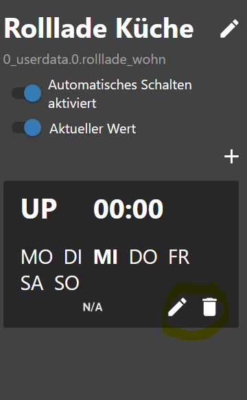

-   Schaltzustand auswählen
-   Eine Bedingung auswählen (optional)
-   Zeit eintragen (hh:mm)

```:warning:
 ⚠ Zeigt in Firefox kein Uhrzeit-Feld an!
```


-   Wochentag auswählen
-   Oben rechts speichern anklicken

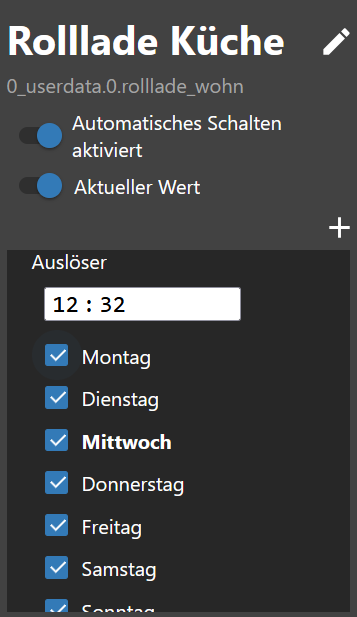

-   Fertig


### Astro Trigger

[Zusammenfassung](#zusammenfassung)

-   Den Stift anklicken um die Astrozeit auszuwählen oder die Mülltonne um den Trigger zu löschen

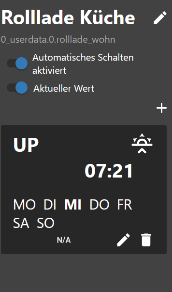

-   Schaltzustand auswählen
-   Eine Bedingung auswählen (optional)
-   Astrozeit auswählen (Sonnenaufgang, Sonnenuntergang oder Mittag)


-   Offset in Minuten eintragen (optional)
-   Wochentag auswählen
-   Oben rechts speichern anklicken

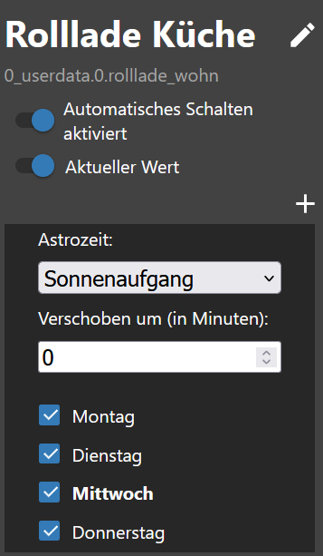

-   Fertig


### One Time Trigger

[Zusammenfassung](#zusammenfassung)

-   Schaltzustand auswählen
-   Eine Bedingung auswählen (optional)
-   Zeit eintragen (hh:mm:ss)
-   Oben rechts speichern anklicken

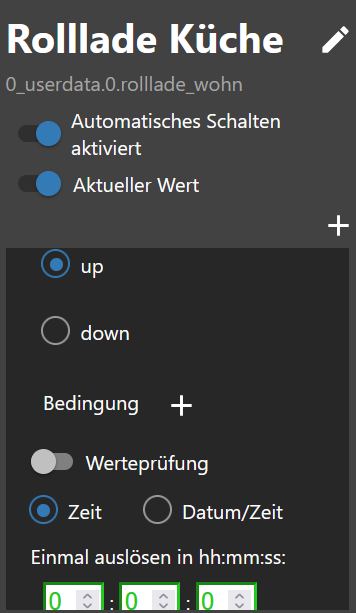

-   Fertig

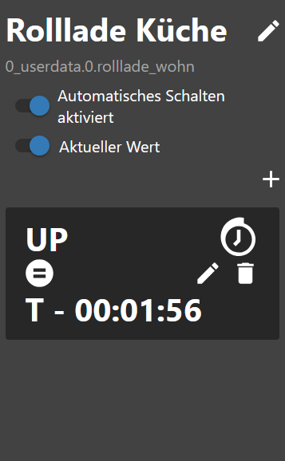

-   Schaltzustand auswählen
-   Eine Bedingung auswählen (optional)
-   Zeit eintragen/auswählen (dd.mm.yyyy hh:mm:ss)
-   Oben rechts speichern anklicken

```:warning:
 ⚠ Zeigt in Firefox kein Uhrzeit-Feld an!
```

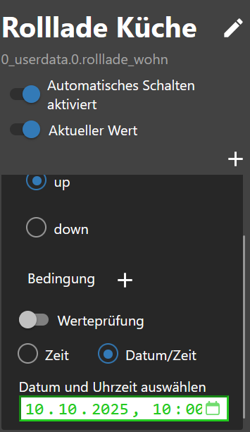</br>


-   Fertig

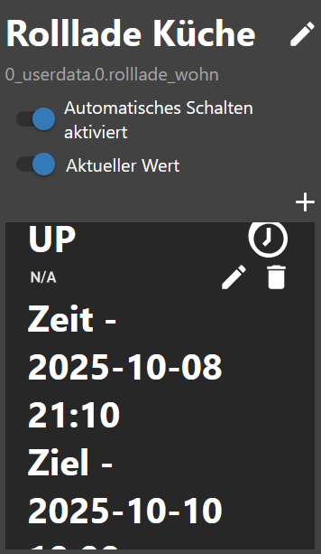

### CSS

[Zusammenfassung](#zusammenfassung)

```
app-on-off-schedules-widget {
    /* Primary color (button background, toggle switch color) */
    --ts-widget-primary-color: #337ab7;

    /* Background color of the widget */
    --ts-widget-bg-color: #424242;
    /* Background color of the triggers */
    --ts-widget-trigger-bg-color: #272727;

    /* Foreground color (font color and scrollbar color) */
    --ts-widget-fg-color: white;
    /* Font color of the switched states id */
    --ts-widget-oid-fg-color: #a5a5a5;
    /* Font color in buttons */
    --ts-widget-btn-fg-color: white;
    /* Font color of a disabled weekday */
    --ts-widget-weekdays-disabled-fg-color: #5D5D5D;
    /* Font color of an enabled weekday */
    --ts-widget-weekdays-enabled-fg-color: white;
    /* Font color of the name of the widget (defaults to --ts-widget-fg-color) */
    --ts-widget-name-fg-color: white;
    /* Font color of switched time (defaults to --ts-widget-fg-color) */
    --ts-widget-switched-time-fg-color: white;
    /* Font color of switched value (defaults to --ts-widget-fg-color)*/
    --ts-widget-switched-value-fg-color: white;
    /* Font color of the astro time (defaults to --ts-widget-fg-color) */
    --ts-widget-astro-time-fg-color: black;
    /* Font color of the astro time's shift */
    --ts-widget-astro-shift-fg-color: #5d5d5d;
    /* Font color of condition (defaults to --ts-widget-fg-color) */
    --ts-widget-condition-fg-color: white;
    /* Font color of toogle button off */
    --ts-widget-off-color: #c0c0c0;
    /* Color background toogle button off */
    --ts-widget-off-color-container: #808080;
    /* Color of next astro switching time */
    --ts-widget-astro-next-fg-color: white;

    /* Font family used in the whole widget */
    --ts-widget-font-family: 'Roboto', 'Segoe UI', BlinkMacSystemFont, system-ui, -apple-system;
    /* Font size of the name of the widget */
    --ts-widget-name-font-size: 2em;
    /* Font size of the switched oid */
    --ts-widget-oid-font-size: 30px;
    /* Font size of switch text */
    --ts-widget-state-action-width: 65px;
    /* Font size of next astro switching time */
    --ts-widget-astro-next-font-size: 2em;
    /* Width of date time input */
    --ts-widget-datetime-width: 230px;

    /* Display of edit name button. Use 'none' to hide the button and 'block' to show it
    --ts-widget-edit-name-button-display: block;
    /* Display of condition. Use 'none' to hide the condition and 'block' to show it
    -ts-widget-condition-display: block;
    /* Display of time icon. Use 'none' to hide the button and 'block' to show it
    --ts-widget-time-icon-display: none;

    /* Applies a filter to icons used in buttons (safe, edit, remove, cancel), for
       white use invert(1) and for black invert(0) */
    --ts-widget-img-btn-filter: invert(1);

    /* Add trigger dropdown background color */
    --ts-widget-add-trigger-dropdown-bg-color: #f1f1f1;
    /* Add trigger dropdown font color */
    --ts-widget-add-trigger-dropdown-fg-color: black;
    /* Add trigger dropdown hover background color */
    --ts-widget-add-trigger-dropdown-hover-bg-color: #ddd;

    /* ! Changing these may break the layout, change at your own risk */

    /* Font size of weekdays */
    --ts-widget-weekdays-font-size: 23px;
    /* Font size of switched value (on/off) */
    --ts-widget-switched-value-font-size: 2em;
    /* Font size of switched time */
    --ts-widget-switched-time-font-size: 2em;
    /* Font size of the astro time (e.g. Sunrise, ...) */
    --ts-widget-astro-time-font-size: 1.5em;
    /* Font size of the astro time's shift */
    --ts-widget-astro-shift-font-size: 1em;
    /* Font size of condition */
    --ts-widget-condition-font-size: 1em;
}
```
