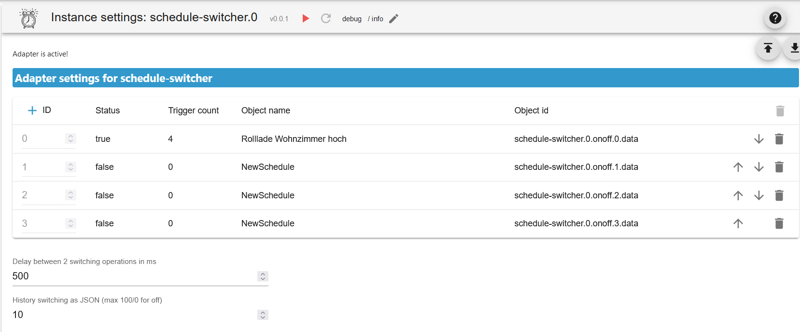
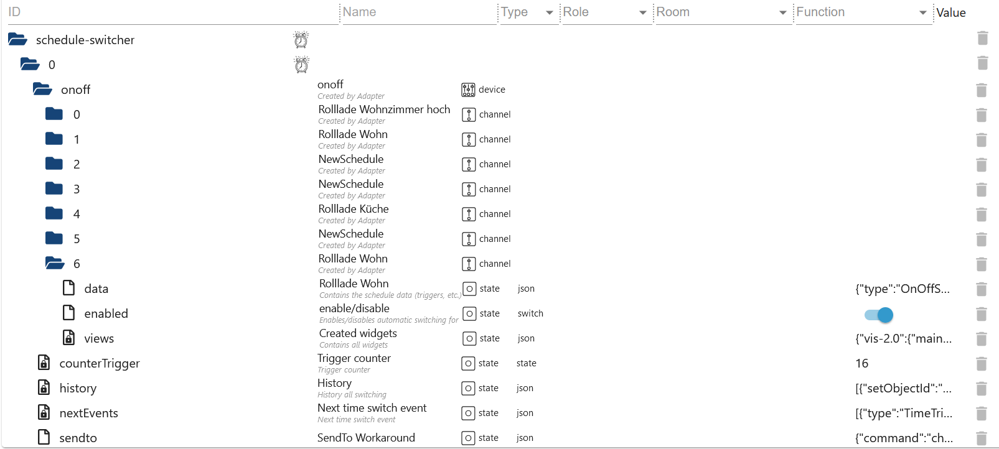
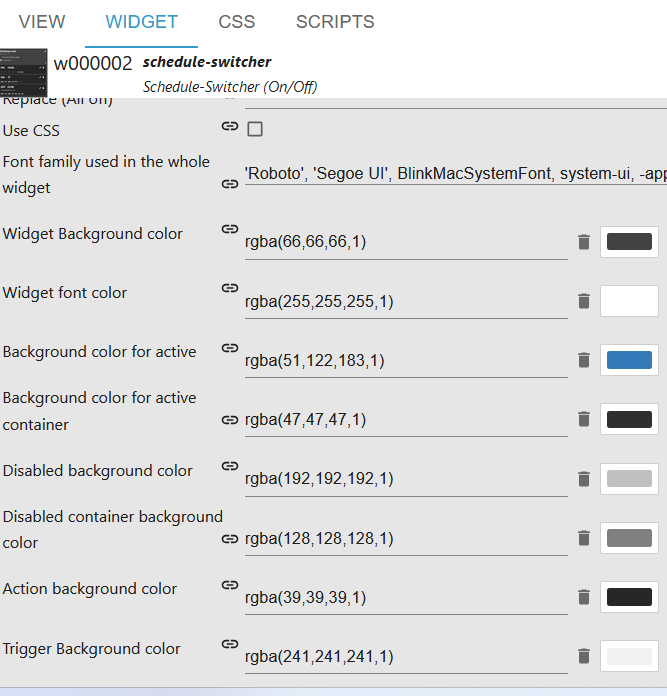
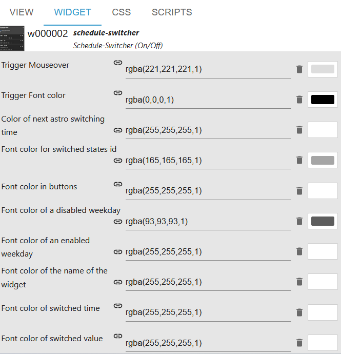
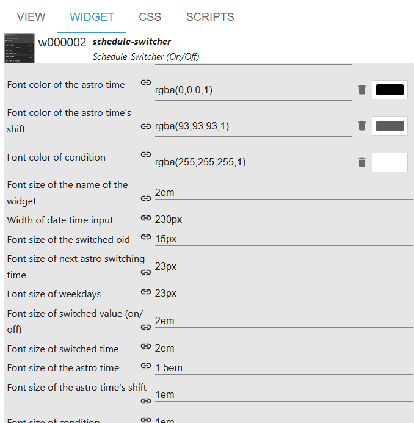
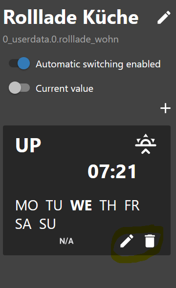
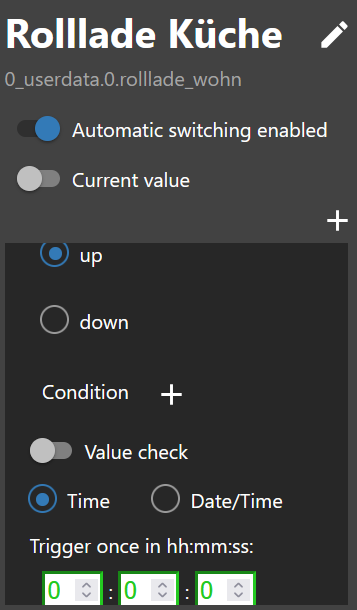

# ioBroker.schedule-switcher

[Back to the README](/README.md)

# Introduction

This adapter allows the user to switch devices on/off or 100/0 using time schedules.
The schedules can be fully configured by a vis or vis-2 widget.
One schedule switches one or more ioBroker states and consists of one or more triggers that define when and how the state should be switched.
It is possible to configure at which time and on which weekdays the trigger should be triggered. Astro triggers or countdowns can also be created.

# Summary

-   [Instance Settings](#instance-settings-schedule-switcher)
-   [Objecte](#states)
-   [Example trigger as JSON](#example-trigger-json)
-   [SendTo Trigger (Experts only)](#example-of-creating-or-editing-triggers-with-sendto-experts)
-   [Example widget as JSON](#example-widgets-json)
-   [Create widget](#create-widget)
-   [Change name](#change-name)
-   [Create condition](#create-condition)
-   [Change text](#change-text)
-   [Use css](#use-css)
-   [Create trigger](#trigger)
-   [create astro trigger](#astro-trigger)
-   [Create one time trigger](#one-time-trigger)
-   [CSS](#css)

### Instance settings schedule-switcher

[Summary](#summary)

-   `Delay between 2 switching operations in ms`: Prevents states from being set at the same time
-   `ADD ON/OFF SCHEDULE`: Add new schedule
-   `Schedule data id`: Created objects
-   `Name`: Name of the widget
-   `Trigger count`: Number of triggers
-   `Enabled`: Status enabled/disabled
-   `delete`: Delete schedule

    

### States

[Summary](#summary)

-   onoff
-   `schedule-switcher.0.onoff.6.data` All triggers as JSON
-   `schedule-switcher.0.onoff.6.enabled` Active or Inactive
-   `schedule-switcher.0.onoff.6.views` Where widgets were created for the objects
-   sendTo
-   `schedule-switcher.0.sendto` With VIS-2, changes are passed to the adapter via this object



# Example trigger JSON

[Summary](#summary)

```json
{
    "type": "OnOffSchedule",
    "name": "Rolllade Wohn", // Name of the last widget created
    "onAction": {
        // Action for On
        "type": "OnOffStateAction",
        "valueType": "number",
        "onValue": 0,
        "offValue": 100,
        "booleanValue": true,
        "idsOfStatesToSet": ["0_userdata.0.test4"] // States max. 10
    },
    "offAction": {
        // Action for Off
        "type": "OnOffStateAction",
        "valueType": "number",
        "onValue": 0,
        "offValue": 100,
        "booleanValue": false,
        "idsOfStatesToSet": ["0_userdata.0.test4"] // States max. 10
    },
    "triggers": [
        {
            "type": "AstroTrigger", // Trigger - AstroTrigger - OneTimeTrigger
            "astroTime": "sunrise",
            "shiftInMinutes": 0,
            "weekdays": [1, 2, 3, 4, 5, 6],
            "id": "0",
            "action": {
                "type": "ConditionAction",
                "condition": {
                    "type": "StringStateAndConstantCondition",
                    "constant": "true",
                    "stateId": "0_userdata.0.test",
                    "sign": "=="
                },
                "action": {
                    "type": "OnOffStateAction",
                    "name": "On"
                }
            }
        }
    ]
}
```

# Example widgets JSON

[Summary](#summary)

```json
{
    "vis-2.0": {
        // Which VIS version
        "Timer": {
            //Project
            "w000009": {
                // Widget ID
                "prefix": "Timer", //Project
                "namespace": "vis-2.0", // Which VIS version
                "view": "default", // Which view
                "widgetId": "w000009", // Widget ID
                "newId": "timer-switch.0.onoff.0.data", // New Object
                "oldId": "timer-switch.0.onoff.1.data" // Old Object
            }
        },
        "main": {
            "w00003": {
                "prefix": "main",
                "namespace": "vis-2.0",
                "view": "Rollladen",
                "widgetId": "w00003",
                "newId": "timer-switch.0.onoff.0.data"
            }
        }
    }
}
```

# Example of creating or editing triggers with sendTo (experts)

[Summary](#summary)

```JSON
sendTo("schedule-switcher.0", "add-trigger", { // Create new trigger
    "dataId":"schedule-switcher.0.onoff.6.data",
    "triggerType":"TimeTrigger",
    "actionType":"OnOffStateAction"
});

sendTo("schedule-switcher.0", "update-trigger", { // Set the action for the new trigger
    "dataId":"schedule-switcher.0.onoff.6.data",
    "trigger":{
        "type":"TimeTrigger",
        "hour":12,
        "minute":32,
        "weekdays":[1,2,3,4,5],
        "id":"0", // Known ID
        "action":{
            "type":"OnOffStateAction",
            "name":"On"
        }
    }
});

sendTo("schedule-switcher.0", "disable-schedule", { // Activate/deactivate trigger
    "dataId":"schedule-switcher.0.onoff.6.data"
});

sendTo("schedule-switcher.0", "add-one-time-trigger", { // Create onetimetrigger
    "dataId":"schedule-switcher.0.onoff.6.data",
    "trigger":"{\"type\":\"OneTimeTrigger\",\"date\":\"2024-10-17T06:14:22.660Z\",\"action\":{\"type\":\"OnOffStateAction\",\"name\":\"On\"}}"
});

sendTo("schedule-switcher.0", "delete-trigger", { // Delete trigger with known ID
    "dataId":"schedule-switcher.0.onoff.6.data",
    "triggerId":"0"
});
```

### Create widget

[Summary](#summary)

-   Insert a widget in a view


-   Select ID for schematic data
-   Select Schedule Activation ID
-   Select ID of the switched state (max. 10 possible)


-   Define value type and the values ​​that should be set


-   Create on time schedule


### Change name

[Summary](#summary)

-   Change names - objects are customized


### Create condition

[Summary](#summary)

-   Create a condition.


### Change text

[Summary](#summary)

-   Change text on/off and all on/all off


### Use css [Description see css](#css)

[Summary](#summary)

-   Use Enable CSS to customize the style</br>
    </br>
    </br>
    

### Trigger

[Summary](#summary)

-   Click on the pen to enter the time or click on the trash can to delete the trigger


-   Select switching state
-   Select a condition (optional)
-   Enter time (hh:mm)


-   Select day of the week
-   Click save at the top right


-   Done


### Astro Trigger

[Summary](#summary)

-   Click on the pen to select the astro time or click on the trash can to delete the trigger



-   Select switching state
-   Select a condition (optional)
-   Select astro time (Sunrise, Sunset or Noon)


-   Enter offset in minutes (optional)
-   Select day of the week
-   Click save at the top right


-   Done


### One Time Trigger

[Summary](#summary)

-   Select switching state
-   Select a condition (optional)
-   Enter time (hh:mm:ss)
-   Click save at the top right



-   Done


### CSS

[Summary](#summary)

```
app-on-off-schedules-widget {
    /* Primary color (button background, toggle switch color) */
    --ts-widget-primary-color: #337ab7;

    /* Background color of the widget */
    --ts-widget-bg-color: #424242;
    /* Background color of the triggers */
    --ts-widget-trigger-bg-color: #272727;

    /* Foreground color (font color and scrollbar color) */
    --ts-widget-fg-color: white;
    /* Font color of the switched states id */
    --ts-widget-oid-fg-color: #a5a5a5;
    /* Font color in buttons */
    --ts-widget-btn-fg-color: white;
    /* Font color of a disabled weekday */
    --ts-widget-weekdays-disabled-fg-color: #5D5D5D;
    /* Font color of an enabled weekday */
    --ts-widget-weekdays-enabled-fg-color: white;
    /* Font color of the name of the widget (defaults to --ts-widget-fg-color) */
    --ts-widget-name-fg-color: white;
    /* Font color of switched time (defaults to --ts-widget-fg-color) */
    --ts-widget-switched-time-fg-color: white;
    /* Font color of switched value (defaults to --ts-widget-fg-color)*/
    --ts-widget-switched-value-fg-color: white;
    /* Font color of the astro time (defaults to --ts-widget-fg-color) */
    --ts-widget-astro-time-fg-color: black;
    /* Font color of the astro time's shift */
    --ts-widget-astro-shift-fg-color: #5d5d5d;
    /* Font color of condition (defaults to --ts-widget-fg-color) */
    --ts-widget-condition-fg-color: white;
    /* Font color of toogle button off */
    --ts-widget-off-color
    /* Color background toogle button off */
    --ts-widget-off-color-container

    /* Font family used in the whole widget */
    --ts-widget-font-family: 'Roboto', 'Segoe UI', BlinkMacSystemFont, system-ui, -apple-system;
    /* Font size of the name of the widget */
    --ts-widget-name-font-size: 2em;
    /* Font size of the switched oid */
    --ts-widget-oid-font-size: 30px;
    /* Font size of switch text */
    --ts-widget-state-action-width

    /* Display of edit name button. Use 'none' to hide the button and 'block' to show it
    --ts-widget-edit-name-button-display: block;
    /* Display of condition. Use 'none' to hide the condition and 'block' to show it
    -ts-widget-condition-display: block;

    /* Applies a filter to icons used in buttons (safe, edit, remove, cancel), for
       white use invert(1) and for black invert(0) */
    --ts-widget-img-btn-filter: invert(1);

    /* Add trigger dropdown background color */
    --ts-widget-add-trigger-dropdown-bg-color: #f1f1f1;
    /* Add trigger dropdown font color */
    --ts-widget-add-trigger-dropdown-fg-color: black;
    /* Add trigger dropdown hover background color */
    --ts-widget-add-trigger-dropdown-hover-bg-color: #ddd;

    /* ! Changing these may break the layout, change at your own risk */

    /* Font size of weekdays */
    --ts-widget-weekdays-font-size: 23px;
    /* Font size of switched value (on/off) */
    --ts-widget-switched-value-font-size: 2em;
    /* Font size of switched time */
    --ts-widget-switched-time-font-size: 2em;
    /* Font size of the astro time (e.g. Sunrise, ...) */
    --ts-widget-astro-time-font-size: 1.5em;
    /* Font size of the astro time's shift */
    --ts-widget-astro-shift-font-size: 1em;
    /* Font size of condition */
    --ts-widget-condition-font-size: 1em;
}
```
